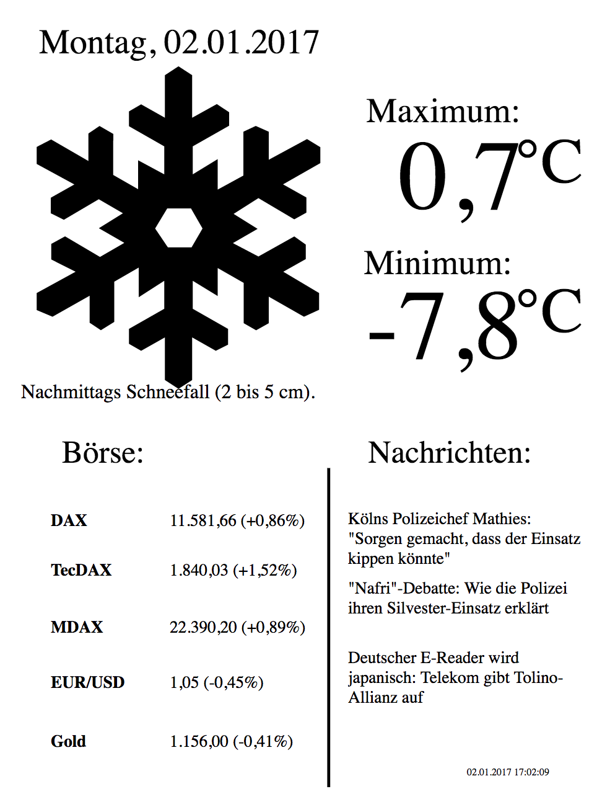

= Generating a dynamic PNG and displaying it on a Kindle E-reader

Small hobby project based on the basic concept from https://github.com/pjimenezmateo/kindle-wallpaper.

I wanted to learn:

* how to hack the kindle e-reader
* training my nodejs skills
* deploying nodejs application to amazon cloud

== Introduction

The nodejs application offers a GET-method to retrieve a "Status" SVG which than can be displayed on the kindle e-Reader. The kindle e Reader only can display PNGs. Therefore the SVG must be converted to PNG. Currently struggling with the conversion to PNG within a docker container. Therefore currently only the SVG is the output of the service call.

For the weather data the application used the forecast weather api (https://darksky.net/forecast/). For the stock ticker the public yahoo api is used. For the news ticker I parse the rss feed of http://www.spiegel.de/. 

== Hacking kindle e-reader

Refer to http://wiki.mobileread.com/ for instruction how to jailbreak your kindle. Basically i followed the instruction there. I jailbreaked my kindle, got ssh access and using the `eips` command on the kindle to display a png file.

== Installation

. Clone this repository
. Run `npm install`
. Edit the link:config.js[config.js] file
.. Enter the server port
.. Enter the api key for the forecast api (get it here: https://darksky.net/forecast)
. To run on local machine: 'node application.js' starts a local server on the port configured in link:config.js[config.js]
. To run it within a docker container
.. build the docker image: `docker build -t kilosh/nodejs-kindle .`
.. Run the docker image: `docker run -d -p 8080:8080 kilosh/nodejs-kindle`. May be you need to adjust the port mappings to your configuration
. To test if everything works send a GET-Request to following URL: http://localhost:8080/getPNG

== Deployment on AWS
I used the amazon ecs (Amazon EC2 Container Service) do deploy the nodejs application. Just following the official ECS tutorial. It is pretty straight forward. Basically you are pushing the created docker container to a private container repository within Amazon cloud. Within ECS you need to define a cluster containg of services. A services contains 1 or multiple task definitions. In the task definition you the previously pushed docker container. After the configuration you start your cluster.

== Roadmap
Converting the produced SVG to a PNG which is able to be processed by the kindles `eips` command.
